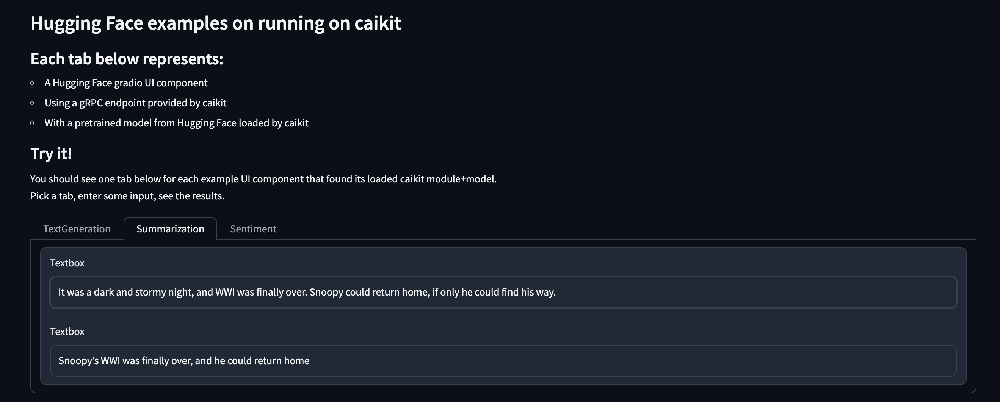
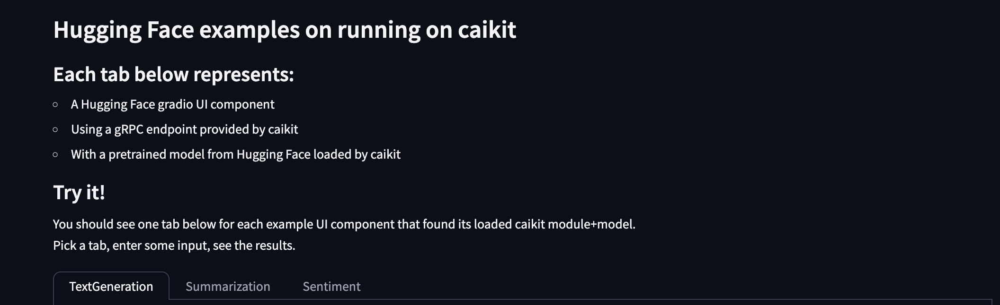
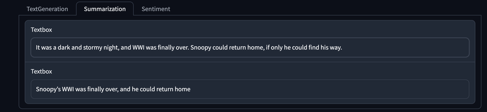
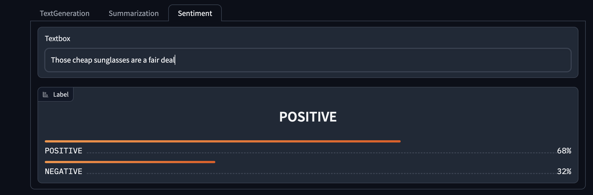
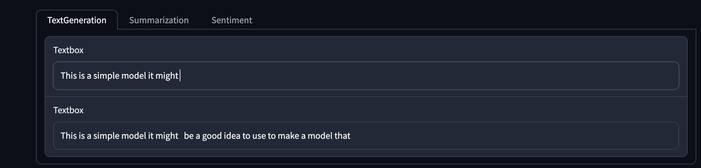
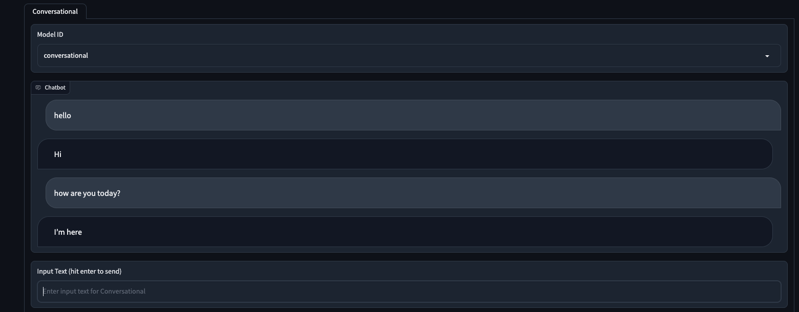

# Caikit Hugging Face examples

This repo contains an example app showing:

* Simple script to start a Caikit backend server
* Simple one-line config files to add Hugging Face models
* Minimal Caikit module implementations for a variety of Hugging Face tasks
* An included gradio UI frontend with interactive model input/output



## Prerequisites

The following tools are required:

- [python](https://www.python.org) (v3.8+)
- [pip](https://pypi.org/project/pip/) (v23.0+)

**Note: Before installing dependencies and to avoid conflicts in your environment, it is advisable to use a [virtual environment(venv)](https://docs.python.org/3/library/venv.html).**

Install the dependencies:

```shell
pip install -r requirements.txt
```

## Run the app

When you run the app it will:

1. Generate data models and endpoints for modules
2. Load models based on `config.yml` files under the `models` subdirectories
3. Serve the endpoints for inference with the loaded models
4. Serve an example UI with input/output forms for enabled tasks/models

### Select models to load

Since you probably do not want to load all the example models, copy the directories you want from example_models to models. For example:

```shell
cd caikit_huggingface_demo
mkdir -p models
cp -r example_models_extras/image_classification models/
```

### Start the server and UI

```shell
cd caikit_huggingface_demo
./app.py
```

Note:  If you prefer to run the backend (Caikit gRPC server) and frontend (gradio UI) separately, use `./app.py --help` to see optional arguments.

### Expected output

You will see gradio UI tabs activated -- or not -- depending on whether the endpoint+model_id is running. When the backend and frontend servers are started, you can click on the link <http://127.0.0.1:7860> to get to the UI. The following is a simplified example of the output.

```ShellSession
(venv)  caikit_huggingface_demo $ ./app.py
Command-line enabled Caikit gRPC backend server and frontend gradio UI
▶️  Starting the backend Caikit inference server...
✅️  Sentiment tab is enabled!
▶️  Starting the frontend gradio UI using backend target=localhost:8085
Running on local URL:  http://127.0.0.1:7860
```

Note:  If port 7860 is not available, it will find another port.

### Use the UI for inference

The tabs represent Hugging Face tasks (and some extras). They are only visible when a model is loaded that implements that task (more details on that in the next section). Each tab has a form with a model dropdown, inputs, and outputs.  It is pretty self-explanatory.  Try it out!  Example screenshots of some of the available UI tabs are below in [Output examples](#output-examples).

> TIP!  Some forms will infer as you type. Cool for demos, right? Others wait until you hit enter. For example, the conversational chat waits for you to hit enter.

Continue reading to learn how to configure additional tasks/models.

## Runtime config

In the app's main [caikit_huggingface_demo/app.py](caikit_huggingface_demo/app.py), we use [caikit_huggingface_demo/runtime/config/config.yml](caikit_huggingface_demo/runtime/config/config.yml) to configure the runtime. This indicates the local library to use for modules and the local directory to use for model configs. This is also where you can configure other things like port.

**[caikit_huggingface_demo/runtime/config/config.yml:](caikit_huggingface_demo/runtime/config/config.yml)**

```yaml
runtime:
  # The runtime library (or libraries) whose models we want to serve using Caikit Runtime. This should
  # be a snake case string, e.g., caikit_nlp or caikit_cv.
  library: runtime
  local_models_dir: models
  # Service exposure options
  port: 8085
  find_available_port: True
```

## Example modules

In our [runtime](caikit_huggingface_demo/runtime) the following modules are available:

| name                 | transformers usage                                       | module_id                               |
|----------------------|----------------------------------------------------------|----------------------------------------|
| sentiment            | Pipeline for sentiment-analysis                          | FADC770C-25C8-4685-A176-51FF67B382C1   |
| summarization        | AutoModelForSeq2SeqLM and AutoTokenizer to generate text | 866DB835-F2EA-4AD1-A57E-E2707A293EB9   |
| text_generation      | AutoModelForCausalLM and AutoTokenizer to generate text  | 9E42606B-34A8-4D4C-9B6C-6F66DAD8EC5A   |
| conversational       | Pipeline for conversational                              | BC008C71-A272-4858-9D43-7297B35ABAC4   |
| object_detection     | Pipeline for object-detection                            | D4C4B6CF-E0C3-4B3F-A325-5071FB126773 |
| image_classification | Pipeline for image-classification                        | D7B3B724-147B-41C1-A41E-A38F9D00F905   |
| image_segmentation   | Pipeline for image-segmentation | D44941F7-6967-45ED-823B-C1070C9257F9 |
| embeddings           | AutoModel, AutoTokenizer to generate embeddings          | 01A9FC92-EF27-4AE7-8D95-E2DC488302D4   |

The `module_id`shown is important.  That is how Caikit determines which module will load a model.

## Minimal model config

The simplest model config looks like this:

```ShellSession
(venv)  caikit_huggingface_demo $  cat example_models/sentiment/config.yml
module_id: FADC770C-25C8-4685-A176-51FF67B382C1
```

Under [example_models](caikit_huggingface_demo/example_models) and [example_model_extras](caikit_huggingface_demo/example_model_extras) we have provided an example for each task using some of the smaller models from Hugging Face.

### How Caikit loads a model for inference

#### Mapping model_id to module_id

At a minimum, Caikit requires a model-to-module mapping for a model to be loaded:

* Using the configured local_models_dir (default is `models`)
  * The `models` directory has `subdir(s)/config.yml` file(s) providing:
    * Model ID (the subdirectory name) for the model
    * `module_id` (attribute in the directory's config.yml) which maps the model to a module

### Loading a model with a module

At startup, Caikit will attempt to load each model in the models directory. In order to do this, the model config must have a `module_id` matching the `module_id` of a module class.

The example modules are intentionally simple. Some examples will (simplest first):

* Load a default model based on a task name
* Load a default model using a hard-coded model name and revision
* Load a model using additional parameters in the model's config.yml

All the examples use Hugging Face models that will be downloaded and cached automatically by the transformers library. This is convenient for a Hugging Face demo app, but is not typical for Caikit usage in production.

### Serving inference endpoints

When a model is loaded for a module, the server will support an inference endpoint for that module (with that model ID). The UI will automatically enable tabs and populate dropdowns with model IDs based on the models that were loaded.

## Output examples

For demo purposes, the top markdown section explains what is going on.  If any gradio UI tabs were activated, they will appear below this.



### Example summarization



### Example sentiment



### Example text generation



### Example conversational


